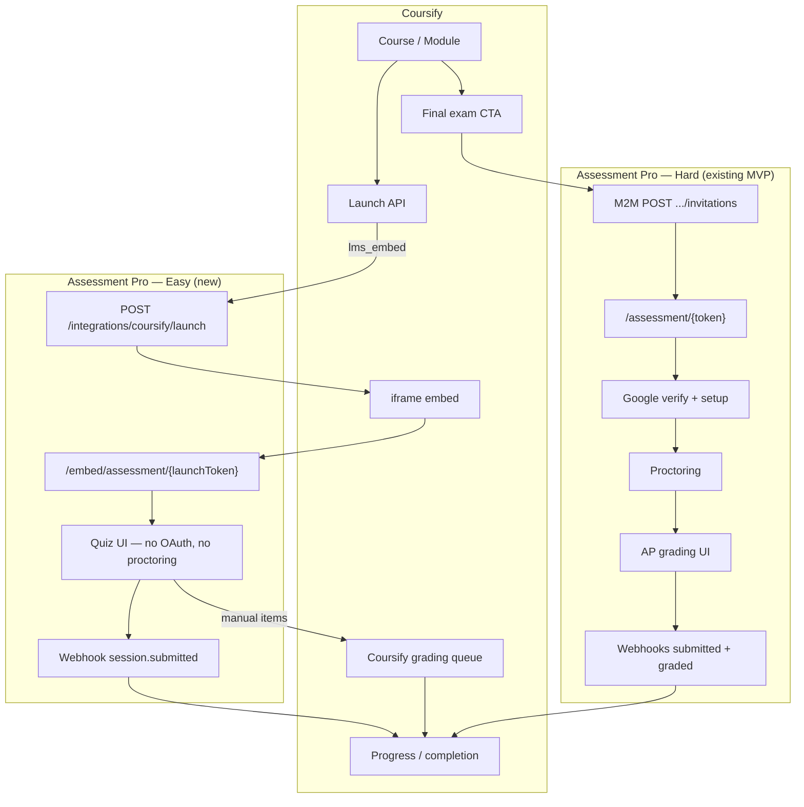
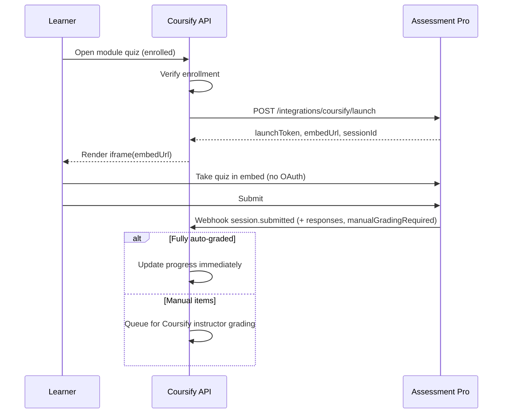
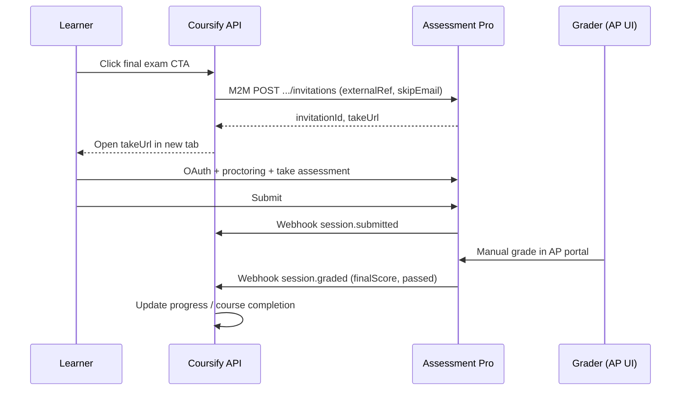

# Assessment Pro × Coursify — Integration Plan

**Status:** Aligned draft (two-mode model)  
**Last updated:** 2026-06-25  
**Assessment Pro repo:** [Raghavendra-Pratap/assessment-pro](https://github.com/Raghavendra-Pratap/assessment-pro)  
**Coursify repo:** [Raghavendra-Pratap/Coursify-dev](https://github.com/Raghavendra-Pratap/Coursify-dev)  
**Coursify development guide:** [`COURSIFY_DEVELOPMENT.md`](COURSIFY_DEVELOPMENT.md)

---

## 1. Goal

Integrate **Coursify** (LMS) with **Assessment Pro** using **two access modes**:

| Mode | Use case | Learner experience |
|------|----------|-------------------|
| **Easy (`lms_embed`)** | In-lesson / module quizzes (MCQ, short answer, etc.) | Embedded iframe inside Coursify Take Course |
| **Hard (`proctored_portal`)** | Final exam, spreadsheet/skills eval, proctored assessment | New tab → Assessment Pro portal (current MVP flow) |

**Keep unchanged on Coursify:** lightweight Google Form quizzes (existing Apps Script webhook).

**Principle:** Assessment Pro live MVP (`/assessment/{token}` with OAuth, proctoring, invitations) is **not modified**. Easy mode uses **new additive routes** (`/embed/*`, integration APIs).

---

## 2. Scope split

| Scenario | Tool | Access mode | Grading |
|----------|------|-------------|---------|
| Quick in-lesson check | Google Form + webhook | N/A | Auto (form) |
| Module quiz / skills check | Assessment Pro | `lms_embed` | AP auto-grade; **Coursify** for manual items |
| Final exam / proctored / sheets | Assessment Pro | `proctored_portal` | **AP grading UI** |
| Course progress / pass-fail | Coursify | Both | Webhooks from AP |

---

## 3. Architecture overview



### 3.1 Easy mode sequence (`lms_embed`)



### 3.2 Hard mode sequence (`proctored_portal`)



---

## 4. Assessment Pro access modes

New field on assessments (settings or column). **Default: `portal`** — all existing assessments unchanged.

| `accessMode` | OAuth | Proctoring | Invitation email | Entry URL | Manual grading |
|--------------|-------|------------|------------------|-----------|----------------|
| `portal` | Per settings | Per settings | Yes | `/assessment/{token}` | AP portal |
| `lms_embed` | **Off** | **Off** (forced) | **No** | `/embed/assessment/{launchToken}` | **Coursify** |
| `proctored_portal` | **On** | **On** | Via M2M (`skipEmail`) | `/assessment/{token}` | AP portal |

**Validation (AP API):** `lms_embed` assessments must be quiz/inline only (no sheet questions). Cannot be opened via public invitation flow.

---

## 5. Assessment Pro deliverables

### 5.1 Easy mode (`lms_embed`) — primary Coursify path

| # | Deliverable | Notes |
|---|-------------|-------|
| 1 | `accessMode` on assessments (default `portal`) | No behavior change for existing data |
| 2 | Integration API key auth | `Authorization: Bearer ap_live_...` scoped to company |
| 3 | `POST /api/v1/integrations/coursify/launch` | Signed launch token; course-gated, no email invite |
| 4 | `/embed/assessment/{launchToken}` | Minimal quiz UI; iframe-safe |
| 5 | `frame-ancestors` CSP for Coursify domains | **Only** on `/embed/*` routes |
| 6 | Submit webhook with rich payload | Scores, `manualGradingRequired`, per-question responses |
| 7 | Optional `postMessage` to parent window | Instant UI feedback in Coursify iframe |
| 8 | `POST /api/v1/integrations/coursify/assessments` | Create quiz assessments from Coursify builder (phase 4) |

### 5.2 Hard mode (`proctored_portal`) — final exam path

| # | Deliverable | Notes |
|---|-------------|-------|
| 1 | M2M `POST /api/v1/companies/{slug}/invitations` | No recruiter browser session |
| 2 | `externalRef` passthrough on invitation | Round-trip enrollment / content IDs |
| 3 | `skipEmail: true` on integration invites | Coursify owns learner notification |
| 4 | Webhooks: `session.submitted`, `session.graded` | Progress sync for proctored flow |
| 5 | Production `AUTH_URL` + Google OAuth/Drive | Required for sheet/proctored assessments |
| 6 | One company slug for v1 (e.g. `coursify-main`) | Shared AP workspace for Coursify content |

### 5.3 Out of scope for v1

- SSO that replaces Google OAuth on hard mode (phase 2+)
- iframe embed for proctored/sheet assessments
- Changing default behavior on existing `/assessment/{token}` routes

---

## 6. Integration API specs (proposed)

### 6.1 Launch (easy mode)

**`POST /api/v1/integrations/coursify/launch`**

Request:

```json
{
  "assessmentId": "uuid",
  "learner": {
    "email": "learner@example.com",
    "name": "Jane Doe",
    "externalUserId": "coursify-user-uuid"
  },
  "externalRef": {
    "enrollmentId": "uuid",
    "contentItemId": "uuid",
    "courseId": "uuid"
  }
}
```

Response:

```json
{
  "launchToken": "short-lived-signed-token",
  "embedUrl": "https://assessments.example.com/embed/assessment/{launchToken}",
  "sessionId": "uuid",
  "expiresAt": "2026-06-25T12:15:00.000Z"
}
```

- One active session per `(enrollmentId, contentItemId, assessmentId)` unless retake policy allows otherwise.
- Launch token TTL: ~15 minutes (configurable).

### 6.2 Webhook payload (both modes)

**`POST {COURSIFY_URL}/api/webhooks/assessment-pro`**

| Header | Value |
|--------|--------|
| `Authorization` | `Bearer {ASSESSMENT_PRO_WEBHOOK_SECRET}` |
| `Content-Type` | `application/json` |

Easy mode (`lms_embed`) — on submit:

```json
{
  "event": "session.submitted",
  "accessMode": "lms_embed",
  "externalRef": {
    "enrollmentId": "uuid",
    "contentItemId": "uuid",
    "courseId": "uuid",
    "coursifyUserId": "uuid"
  },
  "sessionId": "uuid",
  "assessmentId": "uuid",
  "status": "completed",
  "autoScore": 72,
  "maxScore": 100,
  "finalScore": 72,
  "passed": true,
  "manualGradingRequired": false,
  "responses": [
    {
      "questionId": "uuid",
      "type": "multiple_choice",
      "answer": { "selected": "B" },
      "autoScore": 10,
      "maxScore": 10,
      "needsManualGrade": false
    }
  ]
}
```

When `manualGradingRequired: true`, `status` may be `pending_manual_grade` and `finalScore` / `passed` may be null until Coursify completes grading.

Hard mode (`proctored_portal`) — on submit:

```json
{
  "event": "session.submitted",
  "accessMode": "proctored_portal",
  "externalRef": { "enrollmentId": "...", "contentItemId": "...", "coursifyUserId": "..." },
  "invitationId": "uuid",
  "sessionId": "uuid",
  "status": "under_review"
}
```

Hard mode — on grade complete:

```json
{
  "event": "session.graded",
  "accessMode": "proctored_portal",
  "externalRef": { "enrollmentId": "...", "contentItemId": "...", "coursifyUserId": "..." },
  "invitationId": "uuid",
  "sessionId": "uuid",
  "status": "completed",
  "finalScore": 82,
  "passed": true,
  "gradedAt": "2026-06-25T14:00:00.000Z"
}
```

### 6.3 Hard mode invitation create

**`POST /api/v1/companies/{slug}/invitations`** (M2M)

```json
{
  "assessmentId": "uuid",
  "email": "learner@example.com",
  "candidateName": "Jane Doe",
  "skipEmail": true,
  "allowDuplicate": false,
  "externalRef": {
    "enrollmentId": "uuid",
    "contentItemId": "uuid",
    "coursifyUserId": "uuid",
    "courseId": "uuid"
  }
}
```

Response:

```json
{
  "invitation": { "id": "uuid", "token": "..." },
  "takeUrl": "https://assessments.example.com/assessment/{token}"
}
```

---

## 7. Environment variables

### Assessment Pro

```env
AUTH_URL=https://assessments.example.com
INTEGRATION_COURSIFY_ENABLED=true
COURSIFY_WEBHOOK_URL=https://coursify.bsoc.space/api/webhooks/assessment-pro
COURSIFY_WEBHOOK_SECRET=<shared-secret>
COURSIFY_FRAME_ANCESTORS=https://coursify.bsoc.space https://*.bsoc.space
COURSIFY_INTEGRATION_API_KEY=<issued-to-coursify>
```

### Coursify

```env
ASSESSMENT_PRO_BASE_URL=https://assessments.example.com
ASSESSMENT_PRO_COMPANY_SLUG=coursify-main
ASSESSMENT_PRO_API_KEY=<from AP>
ASSESSMENT_PRO_WEBHOOK_SECRET=<same as COURSIFY_WEBHOOK_SECRET>
```

---

## 8. Implementation phases

| Phase | Assessment Pro | Coursify | Notes |
|-------|----------------|----------|-------|
| **0** | Spec sign-off | Review [`COURSIFY_DEVELOPMENT.md`](COURSIFY_DEVELOPMENT.md) | This document |
| **1** | `accessMode` field; default `portal` | — | Zero MVP impact |
| **2** | Launch API + embed routes + frame headers | Launch API + iframe on test quiz | Core easy mode |
| **3** | Submit webhook (rich payload) | Webhook handler + progress sync | Auto-graded quizzes |
| **4** | Coursify grading: AP sends responses | Coursify grading queue UI | Manual quiz items |
| **5** | M2M invitations + graded webhooks | Final exam CTA + new tab | Hard mode |
| **6** | Assessment create API (`lms_embed`) | CreateCourse “Add quiz” | Authoring |

**Effort estimate**

| Team | Easy mode (phases 1–4) | Hard mode (phase 5) | Authoring (phase 6) |
|------|------------------------|---------------------|---------------------|
| Assessment Pro | ~4–5 days | ~2–3 days | ~1 day |
| Coursify | ~3–4 days | ~1–2 days | ~2–3 days |

---

## 9. Security

| Rule | Owner |
|------|-------|
| Never expose `ASSESSMENT_PRO_API_KEY` to the browser | Coursify |
| Launch tokens and invitation tokens stored server-side only | Coursify |
| Verify webhook `Authorization: Bearer` secret | Coursify |
| Support two webhook secrets during rotation | Both |
| Rate-limit Coursify webhook endpoint | Coursify |
| `lms_embed` cannot enable proctoring or sheets at API layer | Assessment Pro |
| Hard mode keeps OAuth + proctoring; no bypass on `/assessment/*` | Assessment Pro |
| Enrollment check before calling AP launch | Coursify |

---

## 10. MVP protection checklist

- [ ] Existing assessments default to `accessMode: portal`
- [ ] No changes to `/assessment/{token}` OAuth or proctoring gates for `portal` / `proctored_portal`
- [ ] `X-Frame-Options: SAMEORIGIN` remains on all non-embed routes
- [ ] Integration APIs behind feature flag + API key
- [ ] Separate auth: invitation token (portal) vs launch token (embed)

---

## 11. References

- Coursify development tasks: [`COURSIFY_DEVELOPMENT.md`](COURSIFY_DEVELOPMENT.md)
- Assessment Pro API: [`docs/API.md`](../API.md)
- Assessment Pro technical reference: [`docs/TECHNICAL_REFERENCE.md`](../TECHNICAL_REFERENCE.md)
- Coursify Google Form webhook (pattern to mirror): `docs/QUIZ_WEBHOOK_GOOGLE_FORMS.md` in Coursify repo
