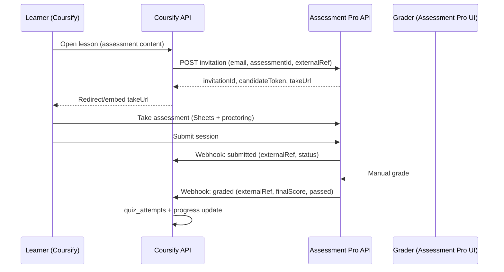

# Assessment Pro × Coursify — Integration Plan

**Status:** Draft for developer alignment  
**Assessment Pro repo:** [Raghavendra-Pratap/assessment-pro](https://github.com/Raghavendra-Pratap/assessment-pro) (v1.1.0)  
**Coursify repo:** This project (Supabase, Next.js 14)

---

## 1. Goal

Use **Assessment Pro** for formal evaluations (timed, proctored, spreadsheet/skills assessments, manual grading).  
Keep **Coursify Google Form quizzes** for lightweight in-lesson checks (existing webhook flow).

Learners stay in the Coursify Take Course flow; high-stakes assessments open Assessment Pro via token link (embed or new tab).

---

## 2. Scope split

| Scenario | Tool | Coursify today |
|----------|------|----------------|
| Quick quiz in a lesson | Google Form + Apps Script webhook | ✅ Implemented |
| Final exam / skills eval / proctored test | Assessment Pro | ❌ Not integrated |
| Instructor manual grading | Assessment Pro grading UI | N/A |
| Auto pass/fail in Coursify progress | Google Form webhook OR Assessment Pro webhook after grade | Partial |

---

## 3. Architecture (target)



---

## 4. Coursify changes (planned)

### 4.1 New content type (or extend quiz)

**Option A (recommended):** Add `content_type = 'assessment'` with table `external_assessments`:

```sql
-- Run in Supabase when implementing
CREATE TABLE IF NOT EXISTS external_assessments (
  id UUID PRIMARY KEY DEFAULT uuid_generate_v4(),
  content_item_id UUID NOT NULL REFERENCES content_items(id) ON DELETE CASCADE,
  provider TEXT NOT NULL DEFAULT 'assessment_pro' CHECK (provider IN ('assessment_pro')),
  assessment_pro_assessment_id UUID NOT NULL,  -- Assessment Pro assessment UUID
  company_slug TEXT NOT NULL,                   -- e.g. coursify-acme
  passing_score INTEGER DEFAULT 70 CHECK (passing_score >= 0 AND passing_score <= 100),
  duration_minutes INTEGER,
  open_in_new_tab BOOLEAN DEFAULT true,
  created_at TIMESTAMPTZ DEFAULT NOW(),
  updated_at TIMESTAMPTZ DEFAULT NOW(),
  UNIQUE (content_item_id)
);

CREATE TABLE IF NOT EXISTS external_assessment_invitations (
  id UUID PRIMARY KEY DEFAULT uuid_generate_v4(),
  enrollment_id UUID NOT NULL REFERENCES enrollments(id) ON DELETE CASCADE,
  external_assessment_id UUID NOT NULL REFERENCES external_assessments(id) ON DELETE CASCADE,
  assessment_pro_invitation_id UUID,          -- set after AP API call
  candidate_token TEXT,                       -- AP invitation token (encrypted at rest TODO)
  take_url TEXT,
  status TEXT NOT NULL DEFAULT 'pending' CHECK (status IN ('pending','sent','in_progress','submitted','graded','expired','cancelled')),
  final_score INTEGER,
  passed BOOLEAN,
  graded_at TIMESTAMPTZ,
  created_at TIMESTAMPTZ DEFAULT NOW(),
  updated_at TIMESTAMPTZ DEFAULT NOW(),
  UNIQUE (enrollment_id, external_assessment_id)
);
```

**Option B:** Store `assessment_pro_assessment_id` + `company_slug` on existing `quizzes` row (`form_url` → `take_url` pattern). Simpler schema, muddier semantics.

### 4.2 Authoring (CreateCourse)

- New **Add Assessment** button (alongside Add Quiz).
- Fields: Assessment Pro **assessment ID** (or picker from AP API), **company slug**, passing score, open in tab vs embed.
- Save into `external_assessments` on course Save.

### 4.3 Take Course

- On learner opening assessment step:
  1. `POST /api/learning/courses/{courseId}/assessments/{contentItemId}/launch`
  2. Server calls Assessment Pro `POST /api/v1/companies/{slug}/invitations` with learner email + `externalRef`.
  3. Return `takeUrl` → open tab or iframe `/assessment/{token}`.
- Poll or webhook updates `external_assessment_invitations.status`.

### 4.4 Coursify webhook (receive from Assessment Pro)

**`POST /api/webhooks/assessment-pro`**

| Header | Value |
|--------|--------|
| `Authorization` | `Bearer {ASSESSMENT_PRO_WEBHOOK_SECRET}` |
| `Content-Type` | `application/json` |

**Body (proposed):**

```json
{
  "event": "session.submitted" | "session.graded",
  "externalRef": {
    "enrollmentId": "uuid",
    "contentItemId": "uuid",
    "coursifyUserId": "uuid"
  },
  "invitationId": "assessment-pro-uuid",
  "sessionId": "assessment-pro-uuid",
  "status": "under_review" | "completed",
  "finalScore": 82,
  "passed": true,
  "gradedAt": "2026-06-22T12:00:00.000Z"
}
```

Handler mirrors `app/api/webhooks/google-form-quiz/route.ts`:

- Verify shared secret
- Upsert `quiz_attempts` (or link via `external_assessment_invitations`)
- Update `progress.quiz_score`, `progress.quiz_passed`
- Optionally mark lesson complete when `passed === true`

### 4.5 Instructor view

- My Courses / Analytics: show assessment status per learner (pending / submitted / graded).
- Link to Assessment Pro grading UI: `{ASSESSMENT_PRO_URL}/{companySlug}/grade/{invitationId}`.

---

## 5. Environment variables (Coursify)

```env
# Assessment Pro integration
ASSESSMENT_PRO_BASE_URL=https://assessments.example.com
ASSESSMENT_PRO_COMPANY_SLUG=coursify-main          # default company; per-tenant later
ASSESSMENT_PRO_API_KEY=                            # M2M key (requested from AP dev)
ASSESSMENT_PRO_WEBHOOK_SECRET=                       # verify inbound webhooks
```

Assessment Pro side (their `.env`):

```env
AUTH_URL=https://assessments.example.com
COURSIFY_WEBHOOK_URL=https://coursify.bsoc.space/api/webhooks/assessment-pro
COURSIFY_WEBHOOK_SECRET=<same as above>
```

---

## 6. What Assessment Pro must provide

| # | Deliverable | Why |
|---|-------------|-----|
| 1 | **Production URL** (`AUTH_URL`) | Embed/link targets |
| 2 | **M2M API auth** (API key or service user JWT) | Coursify server creates invitations without browser session |
| 3 | **Outbound webhook** on submit + on grade | Sync status/scores to Coursify |
| 4 | **`externalRef` passthrough** on invitation create | Round-trip `enrollmentId` + `contentItemId` |
| 5 | **Webhook payload spec** (signed) | Implement `/api/webhooks/assessment-pro` |
| 6 | **One company slug** for Coursify (v1) | Avoid multi-tenant AP setup initially |
| 7 | **Google OAuth / Drive** configured on AP instance | Sheets-based assessments require it |
| 8 | **Clarify grading SLA** | Manual grading only today — learner may wait for pass/fail |

### Optional (phase 2)

- SSO: skip candidate Google verify when launched from Coursify authenticated session
- Assessment picker API for CreateCourse UI
- Auto-sync graded score without separate “graded” webhook if submit includes final score

---

## 7. Implementation phases

| Phase | Coursify | Assessment Pro | Effort |
|-------|----------|----------------|--------|
| **0** | Align on webhook + M2M spec | Implement webhook + API key | 1–2 days AP |
| **1** | Link-out only: paste take URL in lesson | Hosted instance + one template assessment | 0.5 day Coursify |
| **2** | `launch` API + invitation create | M2M `POST .../invitations` + `externalRef` | 2–3 days |
| **3** | Inbound webhook + progress sync | Submit + graded events | 1–2 days |
| **4** | CreateCourse “Add Assessment” + DB migration | Assessment list API (optional) | 2–3 days |

---

## 8. Security notes

- Never expose `ASSESSMENT_PRO_API_KEY` to the browser.
- Store candidate tokens server-side only; learner gets short-lived launch URL from Coursify API.
- Webhook secret rotation: support two secrets during rollover.
- Rate-limit webhook endpoint (same pattern as Google Form quiz webhook).

---

## 9. Message for Assessment Pro developer

Copy/paste below.

---

**Subject: Coursify LMS integration — API + webhooks for assessments**

Hi,

We’re integrating **Coursify** (our Supabase/Next.js LMS) with **Assessment Pro** for formal course evaluations (timed/proctored/spreadsheet assessments). Lightweight in-lesson quizzes stay on Google Forms; Assessment Pro handles end-of-module or end-of-course evaluations.

**What we need from you:**

1. **Hosted instance** — production `AUTH_URL` (e.g. `https://assessments.ourdomain.com`).

2. **Machine-to-machine API access** — Coursify’s server must create candidate invitations without a recruiter browser session:
   - `POST /api/v1/companies/{slug}/invitations`
   - Body includes learner email, `assessmentId`, and an **`externalRef`** object we can round-trip:
     ```json
     { "enrollmentId": "...", "contentItemId": "...", "coursifyUserId": "..." }
     ```
   - Response: `invitationId`, candidate token, and/or full take URL.

3. **Outbound webhooks to Coursify** — on candidate submit and when grading is complete:
   - URL: `{COURSIFY_URL}/api/webhooks/assessment-pro`
   - Auth: `Authorization: Bearer {shared secret}`
   - Payload: `event`, `externalRef`, `invitationId`, `sessionId`, `status`, `finalScore`, `passed`, `gradedAt` (see spec above).

4. **One company slug** for v1 (e.g. `coursify-main`) with at least one publishable assessment template we can reference by ID.

5. **Confirm Google setup** on your side (OAuth redirect URIs, Drive folder) so sheet-based assessments work in production.

6. **Grading workflow** — v1.1 is manual grading only. Please confirm whether “submitted” and “graded” are separate events and typical turnaround expectations.

**What we’ll build on Coursify:**

- Lesson content type “External assessment” with launch API
- Webhook handler updating `quiz_attempts` and lesson progress (same as our Google Form webhook)
- Take Course UI: open Assessment Pro in new tab or embed

Happy to jump on a call to align on `externalRef` shape and webhook signing. Our reference implementation for inbound scoring is `POST /api/webhooks/google-form-quiz` (signed one-time tokens); Assessment Pro webhooks can use a simpler shared-secret model.

Thanks,  
[Your name]

---

## 10. References

- Assessment Pro README: https://github.com/Raghavendra-Pratap/assessment-pro  
- Assessment Pro API: `docs/API.md` in that repo  
- Coursify Google Form webhook: `docs/QUIZ_WEBHOOK_GOOGLE_FORMS.md`, `app/api/webhooks/google-form-quiz/route.ts`
